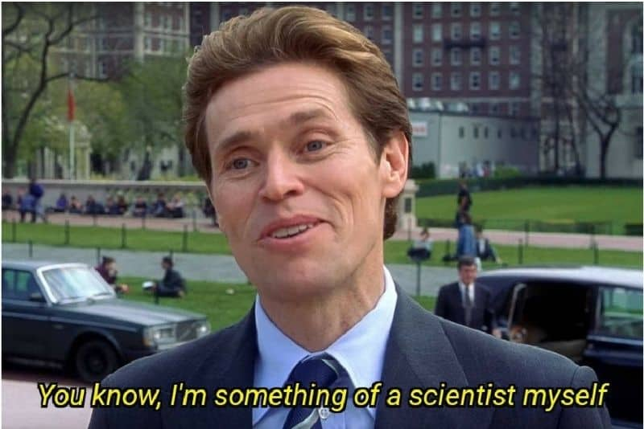

## Things we can do!

Put in a link:

https://www.neonscience.org/

---

## Make it cool {.tabset}

### Wow

Isn't this amazing?

### Double wow

This is too!

### TRIPLE WOW    

lET'S DOWNLOAD DATA DIRECTLY

[link](data/Cows.csv)

